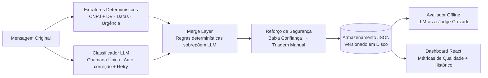

# Message Triage Agent (Agente de Triagem de Mensagens)

> Triagem estruturada de mensagens de negócios baseada em IA: classifica a intenção, extrai entidades, encaminha para a equipe correta e retorna JSON auditável com confiança e justificativa.

  

Uma instituição financeira brasileira recebe diariamente um alto volume de mensagens em texto livre de clientes PJ (empresariais). A triagem manual dessas mensagens consome tempo operacional valioso e gera erros de roteamento. Este projeto classifica cada mensagem em uma taxonomia fixa, extrai entidades (empresa, CNPJ com validação de dígito, documentos identificados, datas), sugere a área de destino e a próxima ação, reporta a confiança da classificação e retorna um contrato JSON rigoroso e auditável — com fallbacks determinísticos quando o modelo não tem certeza.

---

## 🛠️ Arquitetura do Pipeline



---

## 📂 Estrutura do Projeto

O projeto está organizado nos seguintes diretórios principais:

*   [**`backend/`**](file:///c:/Users/everf/OneDrive/Documentos/GitHub-2/message-triage-agent/backend): Contém a API FastAPI, o classificador principal, os extratores determinísticos e o pipeline de avaliação.
    *   [`src/triage/classifier.py`](file:///c:/Users/everf/OneDrive/Documentos/GitHub-2/message-triage-agent/backend/src/triage/classifier.py): Orquestrador que mescla regras de negócio e LLM.
    *   [`src/triage/providers.py`](file:///c:/Users/everf/OneDrive/Documentos/GitHub-2/message-triage-agent/backend/src/triage/providers.py): Camada de adaptadores para APIs de LLM (Anthropic, Gemini, OpenAI) com resiliência de rede.
    *   [`src/triage/extractors.py`](file:///c:/Users/everf/OneDrive/Documentos/GitHub-2/message-triage-agent/backend/src/triage/extractors.py): Funções determinísticas para CNPJ, datas e urgência.
    *   [`evaluation/judge.py`](file:///c:/Users/everf/OneDrive/Documentos/GitHub-2/message-triage-agent/backend/evaluation/judge.py): Avaliador offline que executa a rubrica em cada classificação histórica.
*   [**`frontend/`**](file:///c:/Users/everf/OneDrive/Documentos/GitHub-2/message-triage-agent/frontend): Dashboard analítico e interface visual desenvolvidos em React + Vite.
*   [**`storage/`**](file:///c:/Users/everf/OneDrive/Documentos/GitHub-2/message-triage-agent/storage): Banco de dados em arquivos (JSON versionados) contendo o histórico de classificações (`runs/`), avaliações do juiz (`evaluations/`) e relatórios analíticos gerados (`reports/`).
*   [**`docs/`**](file:///c:/Users/everf/OneDrive/Documentos/GitHub-2/message-triage-agent/docs): Documentações detalhadas de engenharia:
    *   [`architecture.md`](file:///c:/Users/everf/OneDrive/Documentos/GitHub-2/message-triage-agent/docs/architecture.md): Princípios de design, LGPD e modularidade.
    *   [`prompt_engineering.md`](file:///c:/Users/everf/OneDrive/Documentos/GitHub-2/message-triage-agent/docs/prompt_engineering.md): Detalhes da taxonomia, few-shots e restrições de formato do LLM.
    *   [`evaluation.md`](file:///c:/Users/everf/OneDrive/Documentos/GitHub-2/message-triage-agent/docs/evaluation.md): Critérios da rubrica de qualidade e metodologia do LLM-as-a-Judge.
*   [**`specs/`**](file:///c:/Users/everf/OneDrive/Documentos/GitHub-2/message-triage-agent/specs): Especificações de requisitos e planejamento do projeto:
    *   [`overview.md`](file:///c:/Users/everf/OneDrive/Documentos/GitHub-2/message-triage-agent/specs/overview.md): Escopo e visão geral da triagem automatizada.
    *   [`planning.md`](file:///c:/Users/everf/OneDrive/Documentos/GitHub-2/message-triage-agent/specs/planning.md): Cronograma e fases de entrega de cada módulo.

---

## ⚡ Como Rodar o Projeto

### Pré-requisitos
*   **Docker** e **Docker Compose**
*   *Alternativa (Sem Docker)*: Python 3.11+ e Node.js 20+ instalados localmente.

### Configuração do Ambiente
Crie um arquivo `.env` na raiz do repositório a partir do modelo existente:
```bash
cp .env.example .env
```
Abra o arquivo `.env` e preencha com as credenciais de API desejadas:
*   `ANTHROPIC_API_KEY`: Necessária se usar o provedor padrão do classificador (`anthropic`).
*   `GOOGLE_API_KEY`: Necessária se rodar o classificador ou o juiz usando Gemini.
*   `OPENAI_API_KEY`: Recomendada se rodar o LLM-as-a-Judge cruzado com GPT-4o.

---

### Opção 1: Inicialização com Docker (Recomendada)

Suba toda a infraestrutura com um único comando:
```bash
docker compose up --build
```

Isso iniciará:
1.  **Frontend (Dashboard):** Acessível em [http://localhost](http://localhost) (Porta `80` ou `5173` mapeada).
2.  **Backend (FastAPI):** Acessível em [http://localhost:8000](http://localhost:8000). A documentação interativa Swagger está disponível em [http://localhost:8000/docs](http://localhost:8000/docs).

---

### Opção 2: Inicialização Local de Desenvolvimento (Sem Docker)

#### 1. Backend (FastAPI)
Navegue até o diretório do backend, ative seu ambiente virtual e instale as dependências:
```bash
cd backend
python -m venv .venv
# No Windows PowerShell:
.\.venv\Scripts\Activate.ps1
# No Linux/macOS:
source .venv/bin/activate

pip install -e .
```
Para rodar a API de desenvolvimento do FastAPI:
```bash
python -m uvicorn src.triage.api:app --reload --port 8000
```

#### 2. Frontend (React + Vite)
Abra outro terminal, navegue até a pasta do frontend e suba o servidor de desenvolvimento:
```bash
cd frontend
npm install
npm run dev
```
Acesse a interface no endereço indicado pelo terminal (geralmente [http://localhost:5173](http://localhost:5173)).

---

## 🧪 Testes e Qualidade de Código

Para rodar os testes automatizados do backend com cálculo de cobertura de código, utilize o ambiente local:
```bash
cd backend
.\.venv\Scripts\pytest
```

> **Nota:** A suíte de testes unitários roda de forma extremamente rápida sem necessidade de chaves de API reais, pois as chamadas ao LLM são mockadas através de provedores falsos na memória.

Para rodar o linter de código (Ruff):
```bash
cd backend
.\.venv\Scripts\ruff check
```

---

## 📊 Execução de Exemplos e Avaliação (CLI)

Se quiser simular um lote de mensagens, classificá-las e rodar a avaliação offline do Juiz para preencher o Dashboard:

1.  **Gerar execuções de teste:**
    ```bash
    cd backend
    make examples     # Classifica as mensagens de 'examples/inputs.json' -> salva em 'storage/runs/'
    ```
2.  **Executar o Juiz de Qualidade (LLM-as-a-Judge):**
    ```bash
    cd backend
    make evaluate     # Executa a rubrica offline -> salva em 'storage/evaluations/' e gera relatórios em 'storage/reports/'
    ```

---

## 🛡️ Mecanismos de Resiliência Implementados

*   **Decorador de Retry Exponencial com Jitter:** Chamadas de APIs de LLM que eventualmente retornam erros de rede ou indisponibilidade temporária (ex.: `503 UNAVAILABLE` por alta demanda ou `429 Rate Limit`) são automaticamente re-executadas usando *Exponential Backoff* com *Jitter* randômico, evitando sobrecarga coletiva no provedor.
*   **JSON Parser Robusto (`extract_json_object`):** Se o modelo de IA retornar raciocínios intermediários contendo chaves `{}` antes de seu JSON estruturado ou pequenas falhas de delimitador (como falta de vírgula), a aplicação escaneia os pares de chaves abertas do maior bloco para o menor e valida contra o schema exigido (Pydantic), garantindo auto-correção e auto-cura (self-heal).

---

## 📄 Referências Científicas

1.  Khrapunova, O. (2025). *Bridging Zero-Shot and Fine-Tuned Performance in Text Classification through Retrieval-Augmented Prompting.* ASRJETS 103.
2.  Vatsal, S., & Dubey, H. (2024). *A Survey of Prompt Engineering Methods in LLMs for Different NLP Tasks.* arXiv:2407.12994.
3.  Bucher & Martini (2024). *Fine-tuned 'small' LLMs still outperform zero-shot generative models in text classification.* arXiv:2406.08660.
4.  Tam, Z. R. et al. (2024). *Let Me Speak Freely? On the Impact of Format Restrictions.* arXiv:2408.02442.
5.  Zheng, L. et al. (2023). *Judging LLM-as-a-Judge with MT-Bench and Chatbot Arena.* arXiv:2306.05685.
6.  Wei, J. et al. (2022). *Chain-of-Thought Prompting Elicits Reasoning in LLMs.* NeurIPS.
7.  Zhao, Z. et al. (2021). *Calibrate Before Use: Improving Few-Shot Performance of Language Models.* ICML.

---

## ⚖️ Licença

Este projeto está licenciado sob a licença MIT — consulte o arquivo [`LICENSE`](file:///c:/Users/everf/OneDrive/Documentos/GitHub-2/message-triage-agent/LICENSE) para obter detalhes.
